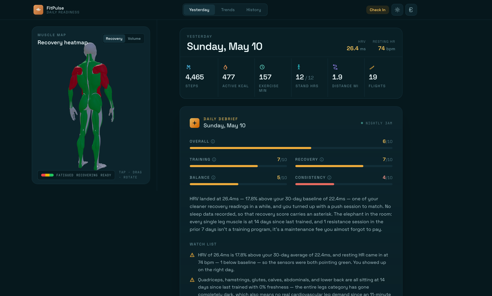

# FitPulse

Personal health performance dashboard. Aggregates Apple Health data, Hevy workout logs, sleep, HRV, and recovery metrics into a single daily readiness view — with Claude AI analysis.



## Stack

- **Backend**: FastAPI (Python), SQLite + DuckDB, APScheduler
- **Frontend**: React + Vite + Tailwind CSS
- **Auth**: Clerk
- **Deployment**: Cloudflare Zero Trust tunnel → `health.zorazhaseeb.com`

## Setup

### Backend

```bash
cd backend
pip install -r ../requirements.txt
# Copy and fill in your secrets:
cp .env.example .env
uvicorn main:app --host 0.0.0.0 --port 8100
```

Required `.env` vars: `APPLE_HEALTH_WEBHOOK_SECRET`, `CLERK_SECRET_KEY`, `CLERK_ISSUER`, `HEVY_API_KEY`, `FRONTEND_ORIGIN`.

### Frontend (dev)

```bash
cd frontend
npm install
npm run dev   # runs on :5173, proxies /api → localhost:8100
```

## Deploying to production

Build the frontend and restart the backend service. The built `dist/` is served directly by FastAPI on port 8100, which the Cloudflare tunnel exposes at `health.zorazhaseeb.com`.

```bash
cd frontend && npm run build

# Restart the backend launchd service
launchctl unload ~/Library/LaunchAgents/com.zoraz.health-dashboard.plist
launchctl load  ~/Library/LaunchAgents/com.zoraz.health-dashboard.plist
```

## Viewing live logs

The launchd service writes stdout/stderr to:

```text
backend/test_logs/launchd.out.log
backend/test_logs/launchd.err.log
```

Watch them live:

```bash
tail -f backend/test_logs/launchd.out.log
# or both streams together:
tail -f backend/test_logs/launchd.out.log backend/test_logs/launchd.err.log
```

To run the backend **interactively** with logs printed to your terminal (useful for debugging):

```bash
launchctl unload ~/Library/LaunchAgents/com.zoraz.health-dashboard.plist
cd backend
uvicorn main:app --host 0.0.0.0 --port 8100
# Ctrl+C to stop, then reload launchd when done:
launchctl load ~/Library/LaunchAgents/com.zoraz.health-dashboard.plist
```

## Architecture

```text
Apple Health (webhook) ──▶ POST /webhook/apple-health ──▶ SQLite daily_snapshot
Hevy (nightly cron)    ──▶ APScheduler 02:00           ──▶ SQLite daily_snapshot
Claude CLI             ──▶ APScheduler 03:00            ──▶ SQLite daily_records.analysis
Frontend               ──▶ GET /api/today               ──▶ React dashboard
```
